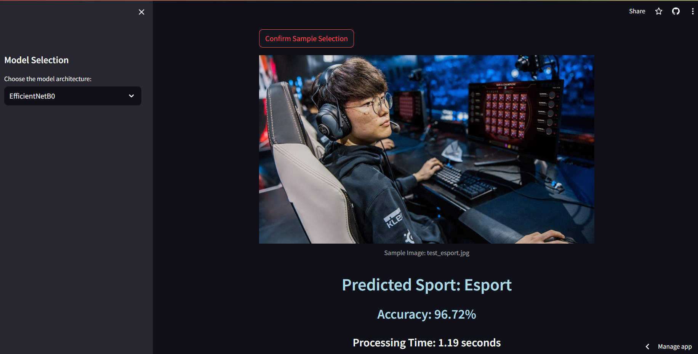

# Sports Image Classification 

- Built an **Images Classification Model** to predict the sport that is being represented in the image.
- Compared five different CNN architectures ie. **EfficientNetB0, VGG19, InceptionV3, ResNet50, and MobileNetV3 Large** based on model performance on this dataset.
- Two fine-tuned **EfficientNetB0 and MobileNetV3 Large** model were used for generating the final predictions which yielded an **Accuracy of 93.38% / 89.60%, F1-Score of 0.93 / 0.89 and Training Time is 1334.83s / 518.69s**.
- A **web app was made using Streamlit** to make predict the sport for new images using the best model.
## Streamlit App
The live app can be viewed [here](https://sportsimageclassifier.streamlit.app/).
## Data
The dataset is a collection of images representing **100 different types of Sports and activities**. The sports range from traditional sports like **"archery", "arm wrestling", "bowling", "football", "water polo", "weightlifting"** to non-traditional ones like **"wingsuit flying" and "nascar racing"**. Addtionally, I added on the new dataset with 10 sports are **"chess", "esport", "dancesport", "paintball", "parkour", "poker", "kayaking", "soccer", "scuba diving" and "sandboarding"**.The goal is the prediction the correct sport based on the image.
- Each image is of size 224 x 224 pixels.


- The images have been segregated into train, test and valid directories in 2 folders are original dataset and new dataset.


- There are 13492 train, 500 test, 500 validation images in original dataset.


- There are 12489 train, 1557 test, 1557 validation images in new dataset.


The original dataset can be downloaded from [here](https://www.kaggle.com/datasets/gpiosenka/sports-classification).
## Experiments on the new dataset (ratio splitting is 80/10/10)
### EfficientNetB0
- The **EfficientNetB0** model was initialized with pre-trained ImageNet weights and all the layers were fine-tuned. Training the model with an **Adam optimizer with learning rate of 0.0005** for **26 epochs** yielded an **Accuracy of 93.38%, F1-Score of 0.93 and Training Time is 1344.83s.**
### VGG19
- The **VGG19** model was initialized with pre-trained ImageNet weights and all the layers were fine-tuned. Training the model with an **Adam optimizer with learning rate of 0.0005** for **10 epochs** yielded an **Accuracy of 74.57%, F1-Score of 0.74 and Training Time is 588.33s.**
### ResNet50
- The **EfficientNetB0** model was initialized with pre-trained ImageNet weights and all the layers were fine-tuned. Training the model with an **Adam optimizer with learning rate of 0.0005** for **14 epochs** yielded an **Accuracy of 84.78%, F1-Score of 0.84 and Training Time is 840.83s.**
### MobileNetV3 Large
- The **EfficientNetB0** model was initialized with pre-trained ImageNet weights and all the layers were fine-tuned. Training the model with an **Adam optimizer with learning rate of 0.0005** for **10 epochs** yielded an **Accuracy of 89.60%, F1-Score of 0.89 and Training Time is 518.69s.**
### InceptionV3
- The **EfficientNetB0** model was initialized with pre-trained ImageNet weights and all the layers were fine-tuned. Training the model with an **Adam optimizer with learning rate of 0.0005** for **34 epochs** yielded an **Accuracy of 82.08%, F1-Score of 0.82 and Training Time is 2166.94s.**

For all the models that were fine-tuned:

- One hidden layer of 350 neuron respectively was added in pre-train out activation.
- Dropout Layer with p = 0.25 was added to prevent over-fitting.
- Number of epochs was 50 with Early Stopping with patience parameter as 3 epochs.
- Batch size of 10 was used for training.
- Categorical Cross-Entropy was used for the loss function.
## Results
- The best results were obtained using a fine-tuned **EfficientNetB0** and **MobileNetV3 Large** model. They were used for generating the final predictions. They achieved an **Accuracy of 93.38% / 89.60%, F1-Score of 0.93 / 0.89 and an Training Time is 1344.83s / 518.69s.**


The results from all the models have been summarized below:

| **Rank** |              **Model**               | **Accuracy** | **F1-Score** | **Training Time** |
|:--------:|:------------------------------------:|:------------:|:------------:|:-----------------:|
|  **1**   |  **EfficientNetB0** *(fine-tuned)*   |    93.38%    |     0.93     |     1344.83s      |
|  **2**   |       **VGG19** *(fine-tuned)*       |    89.60%    |     0.89     |      518.69s      |
|  **3**   |     **ResNet50** *(fine-tuned)*      |    84.78%    |     0.84     |      840.83s      |
|  **4**   | **MobileNetV3 Large** *(fine-tuned)* |    82.08%    |     0.82     |     2166.94s      |
|  **5**   |    **InceptionV3** *(fine-tuned)*    |    74.57%    |     0.74     |      588.33s      |
## Run Locally on Python 3.9 on PyCharm
1.Install required libraries:
`````
!pip install streamlit
!pip install tensorflow
`````
2.Use fine-tuned model on model architectures on streamlit.py:
`````
EfficientNetB0 (EfficientNetB0_80_.h5)
VGG19 (VGG19_80_.h5)
ResNet50 (ResNet50_80_.h5)
MobileNetV3 Large (MobileNetV3Large_80_.h5)
InceptionV3 (InceptionV3_80_.h5)
`````
3.Generate the prediction by model:
`````
EfficientNetB0 (EfficientNetB0_80_.h5)
MobileNetV3 Large (MobileNetV3Large_80_.h5)
`````
## Author 
[@kudo](https://github.com/Kudokunnn/SportsImageClassifier)